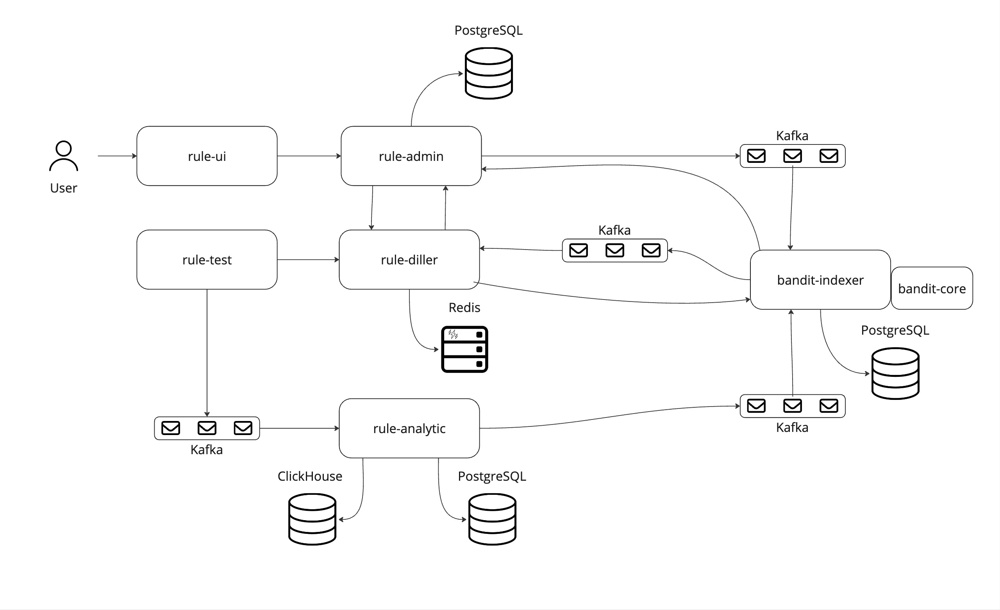

### DisMAB, Distributed Multi-Armed Bandit

Применение алгоритма "многорукий бандит" в масштабируемой системе ранжирования с микросервисной архитектурой.

## Архитектура



## Функционал

1) Для тестирования и нагрузки системы можно использовать rule-test.

    Запросы:

    /v1/test/efficiency
    ``` json
    {
        "target_rps": "800",
        "duration": "120s"
    }
    ```

    /v1/test/load
    ``` json
    {
        "parallel_count": "10",
        "target_rps": "1000",
        "duration": "60s"
    }
    ```

2) Для ручного тестирования можно использовать swagger-ui приложений

## Как развернуть

В папке infra есть скрипт ./up.sh, который подгрузит все нужные образы и поднимет приложение.

## Запросы для метрик

1) `sum(rate(rule_test_data_count[1m])) by (data)`
2) `histogram_quantile(0.99, sum(rate(grpc_handler_duration_ms_bucket[5m])) by (le))`

## Подключение к базам

1) rule-admin-db `jdbc:postgresql://localhost:5432/rule-admin-db`
2) bandit-indexer-db `jdbc:postgresql://localhost:5433/bandit-indexer-db`
3) rule-analytic-db `jdbc:postgresql://localhost:5434/rule-analytic-db`
4) clickhouse `jdbc:clickhouse://localhost:18123/rule_analytic_db`

## Ссылки для локального запуска:
- rule-test http://localhost:8442/swagger/index.html#/
- rule-admin http://localhost:8445/swagger/index.html#/
- rule-diller http://localhost:8447/swagger/index.html#/
- bandit-indexer http://localhost:8449/swagger/index.html#/
- prometheus http://localhost:9090/
- graphana http://localhost:3000/
